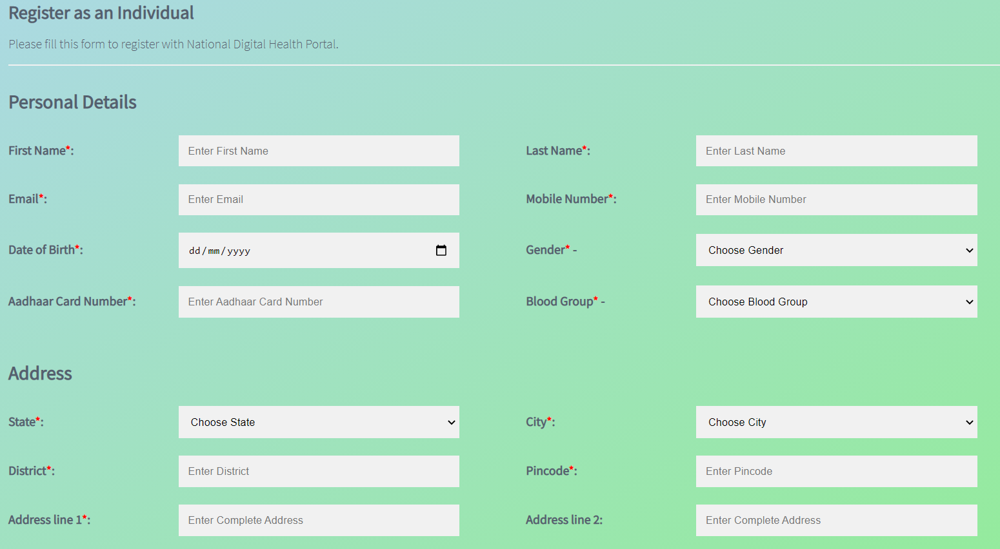
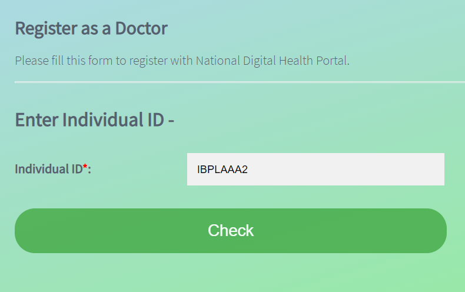
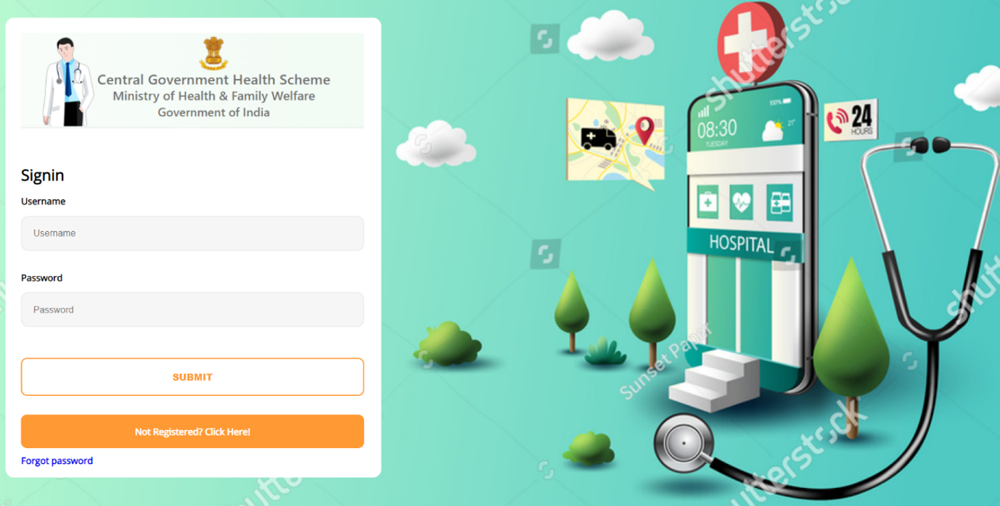

# National-Digital-Health-Portal
<h2><b>Minor project created by Archit Agarwal, Eshan Sharma and Sakshi Sharma using Flask Framework.</b></h2>
<h3><b>Problem Statement</b></h3>
<ul>
    <li>
      There are many tasks in medicine that are repetitive and don’t necessarily require medical expertise.
    </li>
    <li>
        There is a need to optimize these processes and resources in order to streamline the working of medical experts and take away their burden of non-medical tasks such as booking appointments, compiling medical history of patients, compiling laboratory results. 
    </li>
    <li>
        This proposed work uses a website-based user interface for booking appointments, laboratory tests, and a user interface for doctors to see the medical history of patients and lab reports to design a system which reduces the burden of medical professionals from deskwork and let them focus on providing care and support to the patients. 
    </li>
    <li>
        This serves as a very handy and feasible resource for doctors as well as patients as it provides ease of accessing and updating information.
    </li>
     

  

  
</ul>

 

<h3><b>Solution</b></h3>
<ul>
    <li>
        The Project works with the making of a centralized digital health record. 
    </li>
    <li>
        Unique digital IDs will provide a single source of health information for the patients, government and healthcare providers through interoperable health records. 
    </li>
    <li>
        Research shows that the adoption of Electronic Health Records leads to an increase in the quality of care received by the patients while decreasing costs of service.
    </li>
    <li>
        This project is a website that takes in the users' input as input, processes it-saves the appointment, and then gives a confirmation.
    </li>
    <li>
        We created three different classes namely -  
        <ul>
            <li><b>Individuals</b>: Every citizen of India with an Aadhaar Number is can be registered under the individual category. Individuals can create an appointment with Doctors, schedule lab tests/diagnoses, and access medical reports.</li>
            <li><b>Doctors</b>: An individual with a valid registration number (provided by the Medical Council of India) can register further as a Doctor. A Doctor needs to be registered as an Individual first. Doctors can have access to patient's medical records, lab reports and manage other activities. </li>
            <li><b>Laboratories</b>: Any registered Laboratory/ Pathology can enroll. These laboratories will upload patient's reports. Labs will directly be able to add records to the patient's database.</li>
        </ul>
    </li>
</ul>

 
<h3><b>More About The Code</b></h3>
<ul>
    <li>
        The project is based on Python-Flask Framework. We are using MySQL database for storing the information.
    </li>
    <li>
        The registration form for the Individual is shown below. Aadhaar Number is a mandatory field in order to authenticate users using biometric authentications. Each Individual is provided by a unique id called Individual ID (starting with I) .
    </li>
     

  
    

    <li>
        For registration as a Doctor, first Individual ID has to be entered. 
    </li>
     

  

    <li>
        Based on the ID, basic details are pre-fetched from the database and additional information is required to be entered. Post successful registration, a unique ID called Doctor ID (starting with D) is generated.
    </li>
     

  

<li>
    Registration form for Laboratories can be seen below.
</li>

    
  

<li>
    Once registered, the user can use a common Login Page to log in using the username password provided on the email address. The password can be changed through the user dashboard. Users can avail different services based on the category of user.
    

    
  

</li>
</ul>
 
<h3><b>Future Scope</b></h3>
<ul>
    <li>While making this project, ease of accessibility and user-friendliness were kept in mind so that the project can be implemented on the ground. </li>

<li>
    We made sure that everybody is able to glide through the interface smoothly. 
</li>
<li>
    A very important future aspect of this project can be seen in implementing it on the ground as it will greatly decrease the burden of maintaining the medical data of numerous patients on paper. 
</li>
<li>
    The provision of a unique identity number to every user will ensure that the entire medical history of patients, information about doctors, etc. can be made available in a few clicks. 
</li>

</ul>
